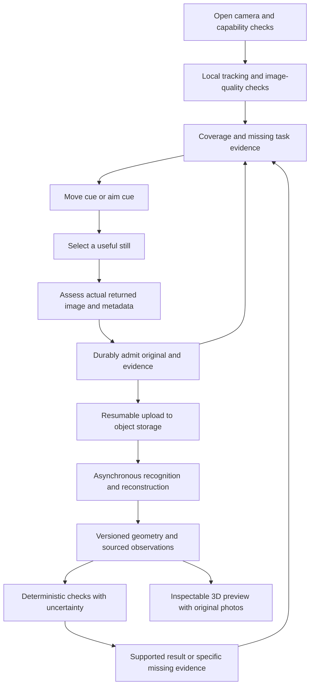

# Live survey research: findings and handoff

September 26, 2026. Research stopped at the user's request. This report packages the completed work, useful implementation proposals, and remaining validation gaps. It is a research handoff, not a production-readiness or installation-accuracy claim.

**Recommendation: build a hybrid evidence loop around native capture.** Use Swift, ARKit and RealityKit for the open camera, pose tracking, photo selection and immediate guidance. Save each useful original photograph with its own calibration and pose. Let asynchronous services perform heavier recognition and reconstruction, then evaluate requirements with explicit evidence and uncertainty. A complete photorealistic house model should not block a useful, source-backed answer.

## What was achieved

| Area | Completed work | Practical outcome |
| --- | --- | --- |
| Camera and capture | Compared native iOS, Android, browser and native-module paths; typechecked relevant ARKit still-capture and guidance APIs; built a durable capture-admission prototype | Native iOS is the leading integration path. Progress must follow the returned, accepted, durably saved photograph—not the preview that triggered it |
| Coverage and guidance | Explored surface coverage, unknown space, task evidence, next-view policies and screen projection; exercised synthetic policies and actual native coverage code | Separate **where to move**, **where to aim**, and **what evidence is still missing**. Geometry revisions can invalidate earlier coverage |
| Reconstruction and visualization | Audited classical, learned batch, streaming and phone-depth alternatives; ran bounded DA3, MoGe, Apple depth and COLMAP probes | Several components run locally, but none establishes exterior measurement accuracy. Keep fast local geometry and slower reconstruction revisions separate |
| Recognition and association | Tested OCR/barcodes, box trackers, image correspondence and causal point tracking; built a revision-aware association prototype | Recognition confidence and a persistent tracking ID do not prove the correct equipment or exact label value |
| Architecture and integration | Checked camera/calibration conversions, evidence admission, reset races, export/version semantics and deployment limits | Preserve originals and coordinate epochs; use resumable object storage separately from compact placement requests |
| Reviewable implementation | Published two standalone Python prototypes and two isolated Swift patch proposals; existing camera-conversion work remains in [PR #9](https://github.com/SamGu-NRX/house-scanning/pull/9) | Useful work is available for selective integration without changing teammates' application branches |

The detailed [options and resources](research/2026-09-26-options-and-resources.md) retain alternatives. The [experiment evidence](research/2026-09-26-experiment-evidence.md) records positive, negative, blocked and unrun outcomes.

## Recommended flow

Local feedback continues while uploads and workers are pending. Capture completion, upload completion, analysis completion and assessment completion are separate states. A newer result is accepted only when its evidence and coordinate dependencies are still valid.

## Findings that change the design

1. **A view is useful only after the actual still is assessed and saved.** A preview may look sharp while the returned still is late, blurred, from another pose, or associated with an obsolete task. The capture prototype makes admission and progress transactional, preserves original evidence, and prevents old coordinate epochs from silently satisfying current spatial requirements.

2. **Fog of war needs more than the path the customer walked.** Surface coverage, unknown/occupied space and required close-up evidence need separate records. A missed ray in an incomplete mesh means unknown. It does not establish open space or a safe route. If ground or wall geometry changes, dependent coverage must be recomputed or invalidated.

3. **Coverage can become stale in the current native implementation.** At the inspected source commit, changing only the ground height retained 14 covered cells; a fresh map with the same cameras and new height had zero covered cells. This is a reproducible software-state inconsistency, not a sensor-accuracy result. The published replay helper is a limited, unrun proposal; its refusal of an unresolved horizontal cell shift still needs an integration policy.

4. **Reconstruction updates can revise earlier geometry.** Adding a fourth image to the DA3 batch changed earlier depth estimates: 3.06% mean absolute relative revision before alignment and 6.51% after it. These describe change, not improved accuracy. Measurements and results derived from revised geometry need revalidation.

5. **Tracking needs a recovery path and independent context checks.** BootsTAPIR processed all 175 frames of one public indoor book sequence. Only **457/1,392** point-frame opportunities were both marked visible and inside the object mask, despite **457/458** containment among visible outputs. There were 77 frames with no visible query. Mask containment cannot establish exact point correspondence or equipment identity. This Mac run also does not establish real-time phone performance.

6. **OCR confidence is insufficient for exact identifiers.** Synthetic native and portable OCR checks produced identifier mistakes at high confidence. Preserve original crops, text spans and field associations; keep unreadable or conflicting values unresolved. Two inspected real photographs supplied observations, not an independently adjudicated accuracy benchmark.

7. **Use separate transport for original photographs.** Vercel documents a 4.5 MB Function request/response envelope. Send original media to a suitable storage endpoint and submit compact scene/placement data separately. Live checks covered only health and schema reads; no upload recovery or placement service was validated. [Vercel limit](https://vercel.com/docs/functions/limitations#request-body-size)

## Implementation delivered

| Artifact | What it contains | Validation boundary |
| --- | --- | --- |
| [Capture admission](../experiments/research-handoff/capture-admission/README.md) | SQLite prototype for request/returned-still separation, atomic evidence admission, epoch/revision checks, crash rollback and acknowledgments | Synthetic bytes and supplied assessments; no camera, real upload or production storage integration |
| [Equipment association](../experiments/research-handoff/equipment-association/README.md) | State machine separating observations, nominated equipment, context revisions and reviewed label associations | Synthetic in-memory transitions; no physical identity or image-recognition validation |
| [Native patch proposals](../experiments/research-handoff/native-proposals/README.md) | Small current-source reset patch plus a separate ground-coverage replay helper proposal | Reset patch passed nine paired harness cases; ground helper remains unrun. Neither was applied to the app |
| [Camera metadata adapter, PR #9](https://github.com/SamGu-NRX/house-scanning/pull/9) | Camera coordinate conversion and input-validation experiment | Existing mathematical tests; not physical calibration or field accuracy |

The public package contains original reusable code, synthetic tests, patch proposals and curated results. Downloaded datasets, model weights, build caches, private source material and detailed local run receipts remain outside Git. Historical failures are retained locally rather than silently replaced by later passes.

Publication validation: the exported capture-admission suite passed **26 tests** and equipment-association suite passed **11 tests** on Python 3.13.7. Their READMEs contain the exact commands. Python syntax, JSON, relative document links and patch hashes were checked; the published implementations match the reviewed source. The app/server/web files were not changed or built in this handoff.

## What remains unresolved

**The largest gap is a real-phone session on representative exterior geometry with independently measured dimensions.** Desktop API checks and synthetic controls cannot answer whether still capture disrupts tracking, whether arrows remain aligned, or whether a phone can sustain the workload without thermal or battery problems.

The next useful work, if resumed, is:

1. **One small field capture:** ordinary supported iPhone first, optional LiDAR comparison. Keep per-image pose, calibration, original bytes and coordinate epochs. Record interruptions, bad captures and recovery—not just the happy path.
2. **Independent geometry checks:** measure identified endpoints with a separate method. Reserve held-out distances when fitting scale or alignment. The acquired TUM reference sequence is ready for a fixed depth-consistency diagnostic, but that diagnostic and model evaluation were not run.
3. **Focused guidance validation:** test move-versus-aim behavior, viewport/orientation changes, stale results and geometry revisions. Observe whether customers follow the cues and whether missing evidence remains visible.
4. **Durable end-to-end integration:** review the isolated reset patch, implement qualified observation replay, test interrupted/background uploads, and bind each assessment to exact image, scene and rules versions.
5. **Representative recognition and identity evaluation:** use adjudicated labels and per-point correspondence/visibility truth. Compare abstention and wrong associations as well as successful reads.

Keep browser coaching, ARCore, alternate reconstruction models and simpler evidence-first outputs available when device reach, measured quality or deployment costs change the tradeoff. No permanent model winner or whole-house accuracy claim was established.

## Addendum (October 11, 2026): wall-fact observability without LiDAR

After this handoff was written, a narrower question was studied as a finite
experiment: **without LiDAR, which wall facts does the recon worker's scene
export support at all?** The study lives in
[`experiments/nonlidar-observability`](../experiments/nonlidar-observability/README.md)
(draft [PR #226](https://github.com/SamGu-NRX/BaseScanning/pull/226), commits
`dda71ad` and `f5a2785`). It binds a pinhole camera per keyframe to the raw
export fields the schema defines (`keyframes[].pose`, `intrinsics`, `w`, `h`),
builds a finite grid of 2625 candidate walls (orientation, distance, both ends,
height), runs five observation-capability scenarios, and calls a fact
**supported** only when every grid world consistent with the observations
agrees on its value, **UNKNOWN** otherwise.

**What the raw fields establish, and what they do not.** Binding fixtures
(`tests/test_packet_binding.py`, stdlib only) pin the *reading* of the export:
pose and intrinsics agree with `recon/recon/capture.py`'s `column_major`
convention, and `walls[].baseline` is `[x, z]` plan points at ground `y = 0`.
They cannot certify *accuracy* — that exported poses are true metric poses,
that the scene frame is truly gravity-aligned, or that landmark identity holds
across keyframes. Those are supplied capabilities of the capture stack, and
every result below is conditional on them.

**Committed engine results (at `f5a2785`).** On the frozen grid: distance,
both ends, and height are supported whenever the corresponding landmarks enter
some frame; height stays UNKNOWN under a top-blind rig, the right end under an
end-blind rig. A tops-only frame — one camera center seeing only the top
corners — hides a **continuous family**: the engine's family walk refits a
materially different wall (face 23.9 ft out, ends ±12.8 ft, top 10.1 ft) whose
observations are byte-identical, because corner rays from one center plus the
scale-homogeneous equal-height constraint leave a one-parameter scale family
about the camera center. The grid's apparent agreement there is a grid
artifact. Orientation is the one fact the scaling cannot turn. Any action that
adds a camera center settles the family; panning in place cannot. The rule
handed to capture coverage: the export supports a wall fact iff some exported
keyframe's frame contains the corresponding landmark — ends and interior marks
need ground coverage, the top corners need top coverage, and a single center
seeing only corners determines orientation and nothing else.

**Orientation vs distance under a withdrawn-metric regime — a credited
finding, not implemented in study code.** Derived in sibling thread
`th_4bNmFneb`; the engine at `f5a2785` probes equivalent pairs only under the
supplied-metric regime, and this construction is not frozen, tested, or
exercised by it. The finding: under the supplied capabilities no rig yields an
orientation or distance equivalent pair on the frozen grid. If the
metric-trust capability is withdrawn — pose translations trusted only up to
one global scale factor, with the gauge fixed on the true world — a
constructed pair (same yaw, every length ×λ) is *exactly equivalent* on a
ruler-free landmark set (ends and top corners only): no ground-plane
observation pins the scale. The study's fixed-offset interior marks (4 ft and
9 ft past the left end) break the similarity — lengths that do not scale with
the wall act as a metric ruler and keep distance determined on the full
landmark set — but the ruler is not free: knowing the marks' offsets in feet
is itself metric knowledge, a supplied capability in another form. Scaling
cannot hide a yaw change, so orientation stays determined in every regime.
Implementing and freezing this regime comparison in the engine would be new
work, not part of PR #226.

**Boundary.** Everything above is a finite-grid statement about one wall on
2625 frozen worlds, conditional on the supplied capabilities. It is not a
general monocular-reconstruction result, and not a field-safety claim. The
largest gap from the parent handoff stands: a real-phone session on
representative exterior geometry with independently measured dimensions.
