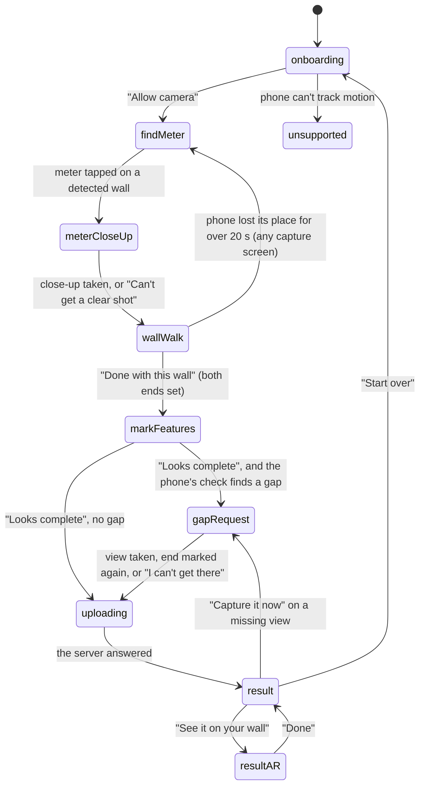

# The flow

## Summary

A scan is one pass through a fixed sequence of screens, from an introduction to a result. The
app decides when to move on: most screens advance by themselves when their job is done, and the
homeowner moves on with a button only where a judgment is theirs (they have finished walking,
their marks are right, they want to see the spot in AR). There is no back button between
screens. "Start over", on the result, is the only way to begin again. This document owns the order
of the screens, what moves the app from one to the next, the launch options, and what happens
when the camera, the replay or the phone cannot run the scan.

## The simple case

The homeowner opens the app and pages through a short introduction ("Next", or "Skip" to the last page), then taps "Allow camera". The
camera opens and asks them to find their electric meter; they aim at it and tap. The phone takes a
close-up of the meter by itself, then asks them to walk along the wall, first to the left and
then to the right, marking where the wall ends on each side. They tap "Done with this wall" and see a list of the
things they marked, where they can add a gas meter, door, window, AC unit, driveway or fence.

When they tap "Looks complete", the phone may ask for one more view of a stretch it did not see well. Then it
sends the scan, shows progress while the server works, and shows the result: whether there is a
spot for the battery, where, how much cable it needs, and each check. From the result they can
see the spot in AR on their wall, and come back.

## The interaction, event by event

The names are the screen names the app logs (see the [glossary](../glossary.md#verification-words)).

### Arriving

The app always opens on `onboarding`. At launch it checks one thing: if the phone cannot run
motion tracking at all, it goes straight to `unsupported` and stays there. Nothing else is checked
up front. Camera permission is asked the first time the camera opens, on `findMeter`.

### Leaving at once

There is no way to leave a scan early other than closing the app. The next launch starts a new
scan on `onboarding`; the earlier scan's photos stay in the phone's cache but are never reopened.

### First capture

The scan's first durable step is the meter tap on `findMeter`. It fixes the wall for the rest of
the scan: the meter's position, the wall's direction and which side is outside. Every later
distance is measured along this wall from the meter.

### While capturing

The camera stays open, without a blink, from `findMeter` through `wallWalk`, `markFeatures` and
`gapRequest`; only the instruction and controls above it change. Photos are kept continuously on
`wallWalk` and `gapRequest` as described in
[coverage and guidance](coverage-and-guidance.md#when-a-photo-is-kept). A counter at the top
shows how many photos have been taken; it goes up once each photo is written to the phone.

### Advancing

A screen whose job ends by itself advances after about 1.2 s, so the homeowner sees the success:
the close-up after it is taken, a gap request after the view is covered. The result appears only
after the server has answered; nothing on `uploading` is skipped when the network fails.

## Modifiers

| Modifier | At arrival | While capturing |
| --- | --- | --- |
| Live camera or replay | With `-replay <folder>` the camera never opens: frames come from a recorded session, the meter tap uses the wall recorded with it, and `unsupported` is not shown even on a phone that can't track. | A replay plays its recording on `meterCloseUp`, `wallWalk` and `gapRequest`; elsewhere it stops. |
| Autopilot | With `-autopilot` (and a replay) the app presses its own buttons through the whole flow and shows a small badge. It needs a replay; with the live camera it logs that and does nothing. | Screens stay up for `-autopilotHold` seconds (default 1.2). The replay plays at three times speed. |
| Server or sample result | With `-serverURL <url>` the scan is uploaded there. Without it, or with `-sampleResult`, the app answers with a built-in sample result and the result says it is a sample. | No effect. |
| Larger text sizes | Screens reflow; see each screen. | No effect. |
| Reduce Motion | Screen changes crossfade in 0.15 s instead of moving. | No effect. |

## Cancel and interrupt

| Event | Before the meter is tapped | After the meter is tapped |
| --- | --- | --- |
| The screen's own way out | See each screen. | See each screen. |
| Start over | Not offered. The failure screen has it for failures other than an unsupported phone, but those never reach it (Open questions). | Offered only on `result`. It forgets the wall, photos, marks and result and returns to `onboarding`. |
| Tracking limited | Coaching replaces the instruction until it clears ([coverage and guidance](coverage-and-guidance.md#one-instruction-at-a-time)). | Same; no photo counts toward coverage meanwhile. |
| Tracking lost or relocalizing | "Point at the meter like this." (relocalizing) or "Your phone lost its place". | If the phone has not found its place within 20 s on a capture screen (`findMeter` through `gapRequest`), the app forgets the wall, photos and marks and returns to `findMeter`. On `uploading`, `result` and `resultAR` the scan and result stay (fixed in `beede15`). |
| App backgrounded or a call | The screen stays; coaching says "Point at the meter like this." when the camera resumes. | Same; photos and marks are kept. |
| Camera off or session failed | Suspected dead end: see Open questions. | Suspected dead end: see Open questions. |
| Network lost or upload failing | No effect. | Only `uploading` is affected; see [the upload](../screens/uploading.md). |
| App killed | The scan is lost. | The scan is lost, including one "saved on this phone" after a failed upload: its files stay in the cache, but nothing reopens or retries them. |

## Interactions with other systems

**Coverage and evidence.** Owned by [coverage and guidance](coverage-and-guidance.md).
**Stored photos.** Kept photos and the close-up are written to a new folder in the app's cache
(`Caches/Scans/<id>/`) as they are taken, and zipped from there for upload. The folder is never
deleted by the app and never reopened. **Upload and offline.** Only the
upload needs the network; see [the upload](../screens/uploading.md). **Accessibility.** Every
screen groups its elements in one accessibility container. Its identifier (`screen.<name>`) is
for tests and is not spoken. **Haptics and motion.** A light tap
for a deliberate photo (the close-up, a requested view) but not for walk photos; a success haptic
when the meter is set and when the result appears; a firmer tap for each mark placed and a warning
for a refused one. **Verification hooks.** Each screen change
logs `STATE=<name>` publicly under subsystem `dev.housescanning.housescan`, category `state`;
guidance changes log `GUIDANCE=<name>` under category `guidance`. `-autopilotGate <folder>` makes
the autopilot wait on each screen until a file named after it appears, for UI tests.

## Edge cases

- The flow has no back navigation. A homeowner who confirms marks too early cannot return to the
  walk; they can only continue or Start over from the result.
- Start over resets the photo counter and every mark; on a replay it shows the recording's first
  frame again.
- A second `STATE` line for the same screen is never logged: moving to the screen already shown is
  ignored.

## Open questions and verification

- **Suspected bug: camera access denied is a dead end.** The failure screen text exists ("House
  Scan needs your camera ... Turn on Camera for House Scan in Settings") but only the
  `unsupported` screen shows failures, and the app switches to it only when motion tracking is
  unsupported (`Runtime/ScanEngine.swift:107`). A denied camera, a failed camera session and an
  unreadable replay set the failure (`ScanEngine.swift:119, 489, 491`) without changing screen. A
  denied camera or a failed session leaves the homeowner on "Find your electric meter" with no
  camera and no Settings button; that part is read from source and not run. The unreadable replay
  is seen: with `-replay /nonexistent` the app stays on onboarding with no message and no way on
  ([bug-triage.md](../bug-triage.md), B-03).
- "Your scan is saved on this phone" is true only while the app runs: after a relaunch nothing
  reopens or retries it.
- Photos of the home accumulate in `Caches/Scans/` across scans and Start over; the app never
  deletes them (`Runtime/KeyframeStore.swift:27`). Worth deciding whether a finished or abandoned
  scan should be removed.
- The 1.2 s pause after a finished step and the 20 s relocalization limit are read from code;
  neither has been timed on a device.

Verified against house-scanning commit `a39d0a5` (t3/ios-mvf).
