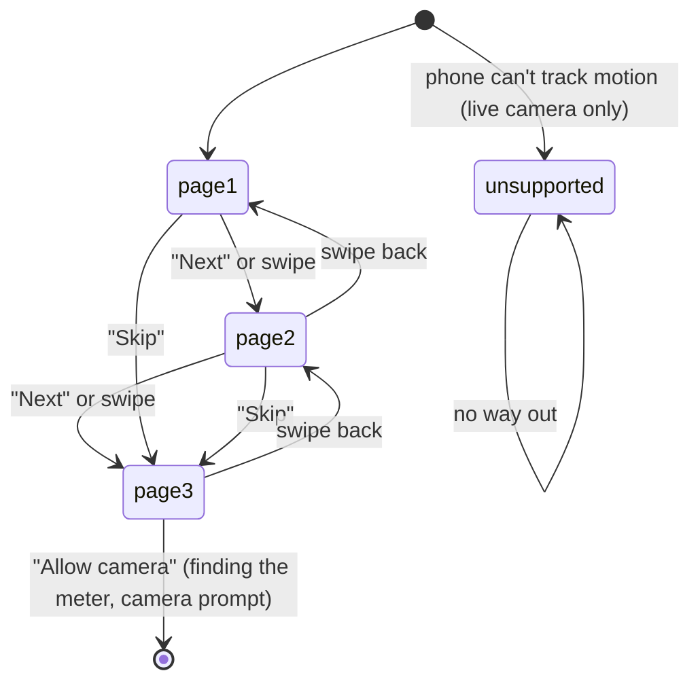

# The onboarding

## Summary

The onboarding is the first thing the homeowner sees on every launch and after every Start over
(screen name `onboarding`). Three intro pages say what the scan is, that the phone takes the
photos, and how to stay safe; the last page's "Allow camera" opens [finding the
meter](find-meter.md), where iOS asks for the camera. The same document covers the failure
screen (screen name `unsupported`), which has one message per failure: an unsupported phone,
camera access denied, a failed camera session, an unreadable replay. At this commit only the
unsupported phone ever reaches it; the other three are set but never shown (see Open questions).

## The simple case

Page 1 shows a drawn wall with a gray meter, a row of blue dots on the ground and a phone sliding
back and forth under an "About 2 min" tag. Its title reads "Let's find a spot for your battery",
with "Walk along the wall by your electric meter for about 2 minutes. Your phone measures as you
go." The homeowner taps "Next". Page 2, "Your phone takes the photos", shows haze clearing off
the drawn wall, with "Just walk slowly. The haze on the wall clears as your phone sees it." They
tap "Next" again. Page 3, "Stay safe out there", lists three safety rules, and "Next" becomes
"Allow camera" with the note "Your phone will ask to use the camera." They tap it, the camera
screen appears with "Find your electric meter", and iOS shows its camera prompt: "House Scan uses
the camera to measure the outside wall around your electric meter."

## The interaction, event by event

### Arriving

The app opens on page 1 with the first of three page dots filled. At the same moment it checks
one thing: with the live camera, if the phone cannot run motion tracking, it switches straight to
the failure screen, crossfading over the intro in 0.25 s. With a replay it instead starts loading
the recording in the background. Nothing else is checked here; in particular the camera
permission is not asked. A top bar holds "Skip" on the right and, on a replay or with the
autopilot, a small badge on the left ("Replay", "Autopilot" or "Replay · Autopilot").

### Leaving at once

"Skip" (top right, on pages 1 and 2) jumps to page 3; it does not leave the onboarding. There is
no way past the intro except "Allow camera", and no back button to anything before it. Closing
the app loses nothing, since nothing has been captured.

On the failure screen for an unsupported phone there is no button at all: the homeowner can only
close the app.

### First capture

Nothing is captured here. The one committed action is "Allow camera": it moves to finding the
meter, and only then does the app start the camera. The first time, starting the camera makes iOS
show its permission prompt over "Find your electric meter". The app does not ask for permission
itself and does not wait for the answer before switching screens.

### While capturing

The pages can also be swiped in either direction; the button below them follows the current page
("Next" on pages 1 and 2, "Allow camera" on page 3) and the dots follow too, the current one
stretching into a pill. Each illustration animates only while its page is showing: the phone on
page 1 walks one lap every 6 s; the haze on page 2 clears column by column over 4 s, holds clear,
then rolls back in, every 6.5 s. Page 3 has no illustration, only three cards: "Stay on the
ground" ("No ladders, roofs or climbing."), "Keep clear of gas pipes" ("Don't lean on or step
over the gas meter.") and "Don't open the meter" ("Leave covers closed and wires alone.").

### Advancing

"Allow camera" always goes to finding the meter. What follows depends on the permission answer:

| Answer | What the homeowner sees |
| --- | --- |
| Allow, or already allowed | The camera image appears behind "Find your electric meter". |
| Declined, now or earlier | Suspected dead end: the screen stays on "Find your electric meter" with no camera image, no message and no way to Settings. Tapping does nothing. |
| The camera session fails | Suspected dead end: the same screen, frozen. |

The failure screen shows one of these, with an icon above the title:

| Failure | Title | Detail | Button | Reached at this commit |
| --- | --- | --- | --- | --- |
| Unsupported phone | "This phone can't measure walls" | "House Scan needs an iPhone that supports motion tracking with the camera. Try another iPhone from the last few years." | None | At launch, live camera only |
| Camera denied | "House Scan needs your camera" | "It uses the camera to measure the wall around your meter. Turn on Camera for House Scan in Settings." | "Open Settings" | No |
| Session failed | "The camera stopped" | The system's error text | "Start over" | No |
| Unreadable replay | "This recording can't be opened" | The loader's error text | "Start over" | No |

"Open Settings" opens the app's page in iOS Settings. "Start over" would do what it does on the
result ([the flow](../foundations/flow.md#cancel-and-interrupt)) and return to page 1.

## Modifiers

| Modifier | At arrival | While capturing |
| --- | --- | --- |
| Live camera or replay | With a replay the motion-tracking check is skipped, so the failure screen never appears at launch, and "Allow camera" never opens the camera or triggers the prompt; the replay's first frame shows behind finding the meter. | No effect. |
| Autopilot | Needs a replay. It waits up to 60 s for the recording to load, holds page 1 for the hold time ([the flow](../foundations/flow.md#modifiers)), then moves on as if "Allow camera" were tapped, without paging. If the recording fails to load it stops and the app stays on page 1. | No effect. |
| Server or sample result | No effect. | No effect. |
| Larger text sizes | Each page's title and body grow and the page scrolls; the illustrations stay 260 pt tall. The failure screen scrolls when its text no longer fits. | The buttons and dots stay fixed below the page. |
| Reduce Motion | The illustrations hold still: the phone stops mid-wall and the haze stops partly cleared. | "Next" slides the page in 0.15 s instead of 0.25 s; "Skip" and swiping are unchanged. |

## Cancel and interrupt

| Event | On the intro pages | On the failure screen |
| --- | --- | --- |
| The screen's own way out | "Skip" to page 3; "Allow camera" on it. | Unsupported phone: none. The other three would offer "Open Settings" or "Start over", but are never shown. |
| Start over | Not offered. Arriving here after Start over shows page 1 again. | Not offered for an unsupported phone. |
| Tracking limited | No effect: the camera is not running. | No effect. |
| Tracking lost or relocalizing | No effect. | No effect. |
| App backgrounded or a call | The current page is kept. | No effect. |
| Camera off or session failed | No effect here; the failure lands after "Allow camera", on finding the meter, as a suspected dead end. | Would show "House Scan needs your camera" or "The camera stopped", but never does. |
| Network lost or upload failing | No effect. | No effect. |
| App killed | Nothing is lost; the next launch opens page 1. | The next launch shows the same screen. |

## Interactions with other systems

**Coverage and evidence.** None; nothing is seen or covered before the meter tap. **Stored
photos.** None are taken. **Upload and offline.** No effect; nothing here needs the network.
**Accessibility.** Each page title is a heading; the illustrations and the page dots are hidden
from VoiceOver; each safety card is read as one element; "Allow camera" carries the hint "Your
phone will ask to use the camera". On the failure screen the icon is hidden and the title is a
heading. The mode badge is read aloud. **Haptics and motion.** No haptics on either screen. Pages
change with a slide, the button swaps with a fade and the dots settle with a 0.4 s spring.
**Verification hooks.** The log records `STATE=onboarding` at launch and `STATE=unsupported`
when the phone check fails; an unreadable replay logs "replay unreadable: ..." without a screen
change. Tests find the controls as `action.onboardingNext`, `action.onboardingSkip`,
`action.finishOnboarding`, `action.openSettings` and `action.startOver`.

## Edge cases

- The app declares motion tracking (`arkit`) as a required device capability
  (`ios/Config/Info.plist`), so the App Store and TestFlight will not install it on a phone that
  lacks it. The unsupported-phone screen is in practice seen only in the Simulator without a
  replay.
- On a live launch the intro is drawn for a moment before the phone check runs, so an unsupported
  phone briefly shows page 1 before crossfading away.
- The note "Your phone will ask to use the camera." shows on every pass, but iOS asks only once.
  After Start over, or on any later launch, no prompt follows.
- Swiping back from page 3 brings "Next" and "Skip" back; nothing on page 3 is committed until
  "Allow camera".

## Open questions and verification

- **Suspected bug: camera denied, a failed session and an unreadable replay never reach the
  screen** (triaged as [B-03](../bug-triage.md)). The engine switches to the failure screen only
  for an unsupported phone (`Runtime/ScanEngine.swift:105-107`). A denied camera and a failed
  session set the failure (`ScanEngine.swift:489, 491`) and an unreadable replay does too
  (`ScanEngine.swift:119`), with no screen change. The unreadable replay is seen: with
  `-replay /nonexistent` the app stays on onboarding with no message and no way on; the camera
  cases are read from source only. The homeowner who declines the prompt sits on
  "Find your electric meter" with no camera image; the "Open Settings" and "Start over" buttons on
  `UI/Screens/UnsupportedScreen.swift:35-48` are unreachable outside the `-uiDemo` preview.
- An unsupported phone gets no button: `UnsupportedScreen.swift:44` hides "Start over" for that
  failure, since nothing on the phone can fix it. [The flow](../foundations/flow.md#summary) says
  the same.
- **Suspected bug: "Allow camera" during replay loading starts the live camera.** On a replay,
  `startSourceIfNeeded` (`ScanEngine.swift:184`) starts the camera whenever the replay has not
  loaded yet and no failure is set. A homeowner who taps "Skip" and "Allow camera" before a slow
  recording loads gets a live session as well as the replay. Affects replays only; not observed.
- **"The camera stopped" would show raw system error text** as its detail
  (`UI/Copy/ScanCopy.swift:260`), the same pattern as B-02, if the screen were ever reached.
- **Reduce Motion is applied to "Next" but not to "Skip"** (`OnboardingScreen.swift:37` versus
  `:75`). Even "Next" still slides the page sideways under Reduce Motion, only faster.
- The page view hides its dots from VoiceOver on the grounds that it announces its own position
  (`OnboardingScreen.swift:158`), but the index display is set to never show (`:54`). Whether
  VoiceOver announces the page number needs checking on a device.
- Read from code, not observed: the camera prompt's timing, ARKit reporting a denied camera as a
  session error, and the Reduce Motion stills. The unsupported screen and the
  `-replay /nonexistent` case can be checked in the Simulator.

Verified against house-scanning commit `a39d0a5` (t3/ios-mvf).
